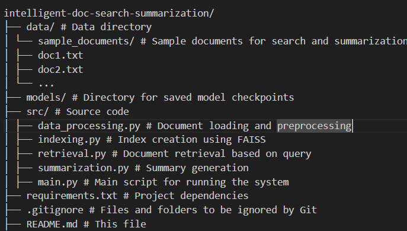

# IntelliDocs: Intelligent Document Search and Summarization

IntelliDocs is a powerful tool that leverages Large Language Models (LLMs) and Retrieval Augmented Generation (RAG) to perform intelligent document search and summarization. Given a user query, IntelliDocs retrieves relevant documents from a corpus, extracts pertinent information, and generates concise summaries, enabling efficient knowledge discovery.

## Features

*   **Intelligent Search:** Utilizes semantic search powered by Sentence Transformers and FAISS for accurate document retrieval.
*   **Contextual Summarization:** Generates abstractive summaries using pre-trained transformer models (e.g., BART).
*   **Handles Various Document Formats:** Supports text files (`.txt`) and provides a framework for extending to PDF and image inputs through added preprocessing steps.
*   **Modular Design:** Clear separation of concerns with modules for data processing, indexing, retrieval, and summarization.
*   **Easy to Use:** Simple command-line interface for interacting with the system.

## Project Structure



## Installation

1. **Clone the repository:**

    ```bash
    git clone https://github.com/your-username/intelligent-doc-search-summarization.git
    cd intelligent-doc-search-summarization
    ```
    Replace `your-username` with your actual GitHub username.
2. **Create and activate a virtual environment (recommended):**

    ```bash
    python3 -m venv .venv
    source .venv/bin/activate  # On Windows: .venv\Scripts\activate
    ```
3. **Install dependencies:**

    ```bash
    pip install -r requirements.txt
    ```
    *Make sure to install `faiss-cpu` if you do not have a supported GPU.*

## Usage

1. **Place your documents:** Add the documents you want to search within the `data/sample_documents/` directory. Currently, `.txt` files are supported.
2. **Run the main script:**

    ```bash
    python src/main.py
    ```
3. **Enter your query:** When prompted, enter your search query.

## Sample Output

**Scenario:** Searching through sample documents about climate change.

**Query:** `What are the impacts of rising sea levels?`

**Output:**
Relevant documents: ['doc2.txt', 'doc1.txt']

Generated summary: Rising sea levels are a major consequence of climate change, threatening coastal communities with flooding, erosion, and saltwater intrusion. Low-lying areas face displacement risks.

Retrieval time: 0.0123 seconds
Summarization time: 1.4567 seconds


**Note:** The output will vary depending on the documents in your `data/sample_documents` directory. The provided example is for illustrative purposes.

## Extending to PDF and Image Input
*   **PDF Handling:**
    *   You'll need to use libraries like:
    *   `PyPDF2`: For basic PDF manipulation and text extraction (if the PDF has selectable text).
    *   `PyMuPDF (fitz)`: A more powerful library for PDF handling, including text extraction and even image extraction from PDFs.
    *   `textract`: A library that can handle various document formats, including PDFs, using other libraries under the hood.

*   **Image Handling:**
    *   **Libraries:**
    *   `Tesseract OCR`: A popular open-source OCR engine.
    *   `pytesseract`: A Python wrapper for Tesseract OCR.
    *   `OpenCV` (cv2): Often used in conjunction with OCR for image pre-processing (resizing, thresholding, noise reduction) to improve OCR accuracy.

## Contributing

Contributions are welcome! Please feel free to submit pull requests or open issues to suggest improvements or report bugs.
